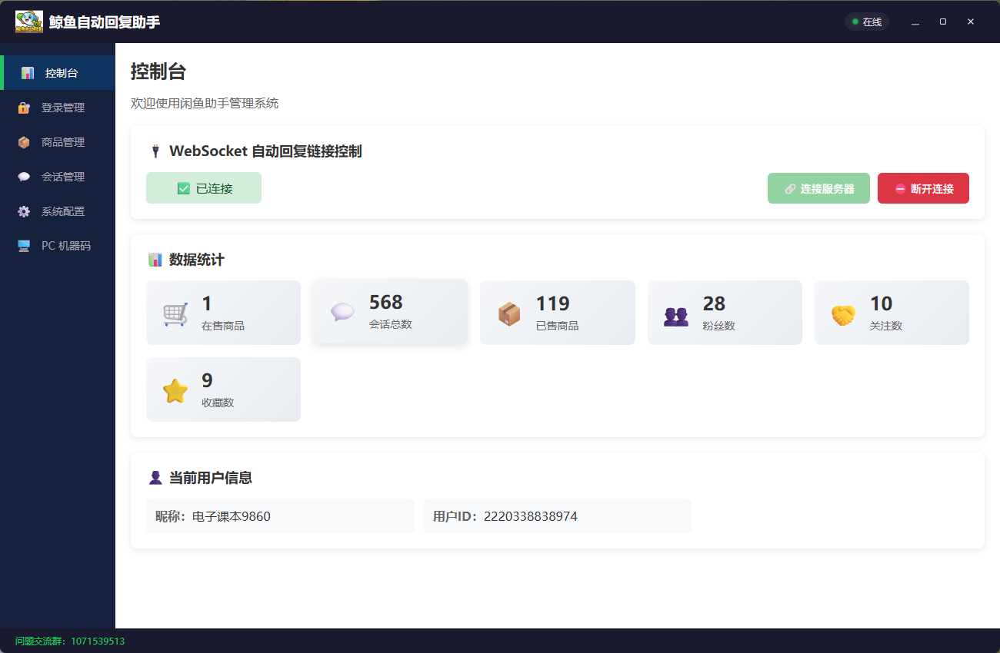

# 🛒 闲鱼助手 - 智能卖家辅助工具

> 专为闲鱼卖家打造的智能辅助工具，帮助卖家高效管理买家咨询、自动回复消息、提升服务效率。
---
# 🛒 应用分享百度网盘链接

### 分享链接：https://pan.baidu.com/s/1Oa2-j-tPC37kaZeSedDKWA?pwd=8888
---

## 🎉 免费领取

**扫码加入 QQ 群，进群即可领取打包好的应用程序！**


**进群福利：项目永久免费** 
- 📦 免费下载使用打包好的应用程序
- 💬 实时技术支持，遇到问题随时问
- 📚 使用教程分享，新手也能快速上手
- 🎁 新功能优先体验
- 🤝 卖家经验交流，共同成长

---

## 📸 功能预览

### 1. 🔐 扫码登录

通过扫码快速登录闲鱼账号，安全便捷。


**功能亮点：**
- 📱 扫码登录，无需输入账号密码
- 🔒 自动管理登录状态，无需手动维护
- 💾 登录状态持久化，重启无需重新登录
- 👤 自动获取用户信息（昵称、头像、用户ID）

---

### 2. 💬 会话管理

查看和管理买家会话，支持多种消息类型。


**功能亮点：**
- 👥 查看所有买家会话列表
- 🖼️ 显示买家头像、昵称、咨询商品
- 💬 支持文本、图片、商品卡片、链接等多种消息类型
- ⏰ 消息时间显示，支持今天和历史日期格式
- 🎨 消息气泡区分（对方消息白色/自己消息绿色）
- 📊 已读状态显示

---

### 3. 🤖 AI 智能回复

集成多个 AI 服务商，智能回复买家咨询。


**功能亮点：**
- 🧠 支持智谱 AI、OpenAI、通义千问等多个 AI 服务商
- 🔗 **OpenAI 兼容接口**：支持任意 OpenAI 格式 API，可接入本地部署的 Ollama、vLLM、LM Studio 等
- 💬 智能回复买家咨询，语气友好、专业、自然
- ✏️ 可自定义 AI 提示词，控制回复风格
- 🧪 支持测试连接，确认 API 可用后再启用
- 📏 生成简短回复（不超过 50 字）

**支持的模型：**
| 服务商 | 推荐模型 | 特点 |
|--------|----------|------|
| 智谱 AI | glm-4-flash | 免费额度充足，响应快速 |
| OpenAI | gpt-3.5-turbo | 性价比高，适合日常使用 |
| OpenAI | gpt-4 | 回复质量更高，适合高端商品 |
| 通义千问 | qwen-turbo | 中文理解能力强 |
| **OpenAI 兼容** | **任意模型** | **支持本地部署或第三方 API，灵活定制** |

**OpenAI 兼容接口支持：**

本工具支持标准 OpenAI Chat Completions API 格式，可无缝接入以下服务：

| 服务类型 | 示例 | 优势 |
|----------|------|------|
| 本地部署 | Ollama、vLLM、LM Studio | 数据完全私有，无需网络，免费使用 |
| 第三方 API | 硅基流动、火山引擎、阿里云百炼 | 价格低廉，模型丰富 |
| 代理转发 | 各种 OpenAI 代理 | 便捷访问，稳定可靠 |

**配置示例：**

```
服务商选择：自定义
API 地址：http://localhost:11434/v1/chat/completions  （Ollama）
API Key：任意字符串（本地部署通常不需要）
模型：llama3 或 qwen2.5（根据本地部署的模型填写）
```

**本地部署推荐方案：**
- 🐋 **Ollama**：轻量级本地 AI 框架，支持一键部署多种模型
- 🚀 **vLLM**：高性能推理引擎，适合高并发场景
- 💻 **LM Studio**：图形化界面，简单易用

---

### 4. 📦 商品管理

查看和管理在售商品，了解销售情况。


**功能亮点：**
- 📋 查看在售商品列表
- 🖼️ 显示商品图片、标题、价格
- 📊 查看商品状态（在售/下架/已售出）
- 👀 查看商品想要人数
- 🚚 包邮状态显示
- 🔄 支持拉取最新商品数据
- 📂 支持展开/收起商品列表

---

### 5. 📄 商品详情

查看单个商品的详细信息。


**功能亮点：**
- 📝 商品完整信息展示
- 🏷️ 商品标签、状态、价格
- 📈 想要人数、浏览量
- 🔗 商品链接直达
- 🖼️ 商品图片高清展示

---

### 6. 🔑 商品关键词管理

为每个商品设置专属的关键词回复规则。


**功能亮点：**
- 🎯 针对特定商品设置专属回复
- 📝 支持多个关键词，每个关键词对应不同回复
- ⚡ 优先级最高，商品专属关键词优先于全局关键词
- 📊 关键词匹配百分比设置（50%-100%）

**使用示例：**
```
商品：二手 iPhone 13
关键词设置：
  "电池" → "电池健康度 92%，正常使用没问题"
  "配件" → "原装充电器+保护壳都有"
  "成色" → "95新，轻微使用痕迹"
```

---

### 7. 🌍 全局关键词设置

设置适用于所有商品的通用关键词回复。


**功能亮点：**
- 🌐 适用于所有商品的通用关键词
- 📝 支持多个关键词，每个关键词对应不同回复
- ⚙️ 匹配百分比阈值可配置
- 🔄 支持在线添加、编辑、删除关键词

**默认关键词：**
| 关键词 | 回复内容 |
|--------|----------|
| 在吗 | 在的，请问有什么可以帮助您的？ |
| 你好 | 您好！欢迎咨询，请问有什么可以帮助您的？ |
| 价格 | 这款的价格很实惠，具体您可以看看商品详情页！ |
| 包邮 | 我们是包邮的，请放心购买！ |
| 发货 | 今天下单，明天发货！ |
| 现货 | 有的是现货，下单后尽快发出！ |

---

### 8. 📋 预设关键词设置

设置当关键词未匹配时的默认回复。


**功能亮点：**
- 🎲 随机选择一条预设回复
- 📝 支持多条预设回复
- ⚙️ 灵活管理，随时增删改
- 💬 确保每条消息都有回复，不会漏回

**默认预设回复：**
- "您好，请问有什么可以帮助您的？"
- "在的，请说！"
- "好的，我马上为您处理！"
- "感谢您的咨询，我会尽快回复您！"

---

### 9. 🛡️ 系统消息过滤

过滤系统消息，避免干扰。


**功能亮点：**
- 🚫 自动过滤系统通知
- 📭 避免无效消息干扰
- ⚙️ 可配置过滤规则
- 📊 过滤日志记录

---

### 10. 🖥️ 控制台

查看系统运行日志和状态。



**功能亮点：**
- 📜 实时显示系统运行日志
- 🔍 支持日志搜索和筛选
- 📊 显示系统状态（在线/离线）
- 🐛 错误日志高亮显示
- 📋 日志导出功能

---

## 🎯 核心优势

### 🚀 提升效率
- **自动回复**：无需手动回复每条消息，节省大量时间
- **关键词匹配**：常见问题自动回复，精准匹配买家需求
- **AI 智能回复**：高级 AI 技术，回复更自然、更专业

### 💰 降低成本
- **减少人力**：无需雇佣客服，自动处理买家咨询
- **24/7 在线**：全天候自动回复，不错过任何潜在客户
- **灵活配置**：根据商品特点自定义回复策略

### 📈 增加转化
- **快速响应**：秒级回复，提高买家满意度
- **专业形象**：AI 生成专业回复，提升店铺形象
- **个性化服务**：针对不同商品设置专属回复，提升转化率

---

## ⚠️ 注意事项

1. 本工具仅供个人使用，请勿用于商业用途
2. 请遵守闲鱼平台规则，合理使用自动回复功能
3. AI 回复内容仅供参考，建议定期检查和调整
4. 请妥善保管 API Key，避免泄露
5. 卡密授权绑定设备，请勿共享给他人使用，卡密永久免费

---

## 📞 技术支持

- **QQ 交流群**：1071539513
- **版本**：1.0.0
- **更新日期**：2026-07-19

---

<div align="center">

**扫码进群，免费领取使用！**

</div>

---

## ✨ 功能特性

| 功能 | 说明 |
|------|------|
| 🔐 **登录管理** | 扫码登录闲鱼账号，自动管理 Cookie |
| 💬 **会话管理** | 查看和管理所有买家会话列表 |
| 🤖 **AI 智能回复** | 集成智谱 AI / OpenAI / 通义千问，智能回复买家咨询 |
| 📦 **商品管理** | 管理在售商品，查看商品详情 |
| ⚙️ **系统配置** | 关键词回复、自动回复规则配置 |
| 🖥️ **PC 机器码** | 设备唯一标识生成与卡密状态查询 |

---

## 🏗️ 技术架构

```
┌─────────────────────────────────────────────────────────┐
│                     Electron 主进程                       │
│  (窗口管理 / IPC 通信 / 后端启动 / 代理服务器)              │
├─────────────────────────────────────────────────────────┤
│                     预加载脚本 (preload)                   │
│  (安全暴露 API 给渲染进程)                                 │
├──────────────┬──────────────────────────────────────────┤
│  渲染进程     │              Python 后端                   │
│  (Vue 3)     │  (FastAPI / 闲鱼 API / 消息处理)            │
│              │                                            │
│  ┌────────┐  │  ┌──────────────────────────────────┐     │
│  │ 控制台  │  │  │ callbacks.py   message_handler   │     │
│  │ 登录管理│  │  │ login_service  items_service     │     │
│  │ 商品管理│  │  │ ai_service     keyword_service   │     │
│  │ 会话管理│  │  │ ws_manager     cookie_utils      │     │
│  │ AI 配置 │  │  └──────────────────────────────────┘     │
│  │ PC 机器码 │  │                                            │
│  └────────┘  │                                            │
└──────────────┴──────────────────────────────────────────┘
```

### 技术栈

| 层 | 技术 |
|----|------|
| 桌面框架 | Electron 43.0.0 |
| 前端框架 | Vue 3 + TypeScript + Vite |
| UI 组件 | Element Plus |
| 路由 | Vue Router (Hash 模式) |
| 后端语言 | Python 3.9+ |
| 后端框架 | 自定义 HTTP + WebSocket |
| 打包工具 | Electron Builder |

---


## 📄 许可证

MIT License

---

## 👥 作者

免费辅助开发者

---

## 🙏 致谢

- [Electron](https://www.electronjs.org/)
- [Vue 3](https://vuejs.org/)
- [Element Plus](https://element-plus.org/)
- [闲鱼](https://www.xianyu.com/)
git add README.md
git commit -m "Update Baidu Pan link format"
git push